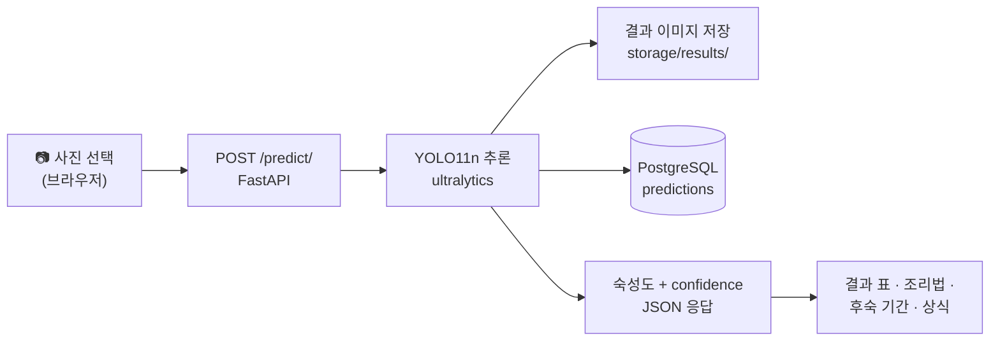

<div align="center">


# 🍌 바나나 숙성도 판별 PWA

**사진 한 장으로 바나나의 숙성 단계를 판별하고, 지금 상태에 맞는 먹는 법과 남은 후숙 기간을 알려주는 웹 앱**

<sub>YOLO11n 객체 탐지 · FastAPI · PostgreSQL · 설치 없이 홈 화면에 담기는 PWA</sub>

</div>

---

## 무엇을 하는 앱인가

바나나는 "먹어도 되나?"를 매번 눈대중으로 판단하게 되는 과일입니다. 이 앱은 그 판단을 대신합니다.
사진을 올리면 화면에 찍힌 바나나를 **하나씩 따로** 찾아내고, 각각을 네 단계로 분류합니다.

| 클래스 | 화면 표기 | 어떤 상태인가 |
| --- | --- | --- |
| `unripe` | 미숙성 | 아직 초록빛. 전분이 많아 그대로 먹기엔 이르다 |
| `ripe` | 숙성 | 노랗고 먹기 좋은 상태 |
| `overripe` | 과숙성 | 갈색 반점이 퍼진 상태. 달지만 물러진다 |
| `rotten` | 상함 | 먹기 어려운 상태 |

판별이 끝나면 세 가지가 이어집니다.

1. **조리 · 섭취 방법** — 판별된 숙성도에 맞는 방법만 골라 보여줍니다. (덜 익은 바나나면 소화 주의 문구도 함께)
2. **후숙 예상 기간** — 보관 습도와 온도를 고르면 며칠 뒤 갈변하는지 알려줍니다. 이미 과숙성·상함이면 이 카드는 뜨지 않습니다.
3. **바나나 상식** — 판별할 때마다 새로 뽑아 보여줍니다.

분석 기록은 브라우저(localStorage)에 최근 20건까지 남아, 왼쪽 사이드바에서 다시 열어볼 수 있습니다.

## 동작 흐름



프런트엔드는 정적 파일만으로 돌아가고, 무거운 일(추론·저장)은 전부 백엔드가 맡습니다.
서비스 워커가 화면 껍데기를 캐시하므로 **오프라인에서도 앱이 열리기는 합니다. 다만 판별은 서버를 부르므로 인터넷이 필요합니다.**

## 기술 스택

| 영역 | 사용 기술 |
| --- | --- |
| 프런트엔드 | 바닐라 HTML / CSS / JavaScript, PWA (manifest + Service Worker), 라이트·다크 테마 자동 대응 |
| 백엔드 | Python 3.12+, FastAPI, Uvicorn |
| 데이터베이스 | PostgreSQL, SQLAlchemy ORM |
| 추론 | Ultralytics YOLO11n (`backend/weights/best.pt`) |

프레임워크나 빌드 도구가 없습니다. 프런트엔드는 정적 서버로 그냥 열면 되고, 번들링 단계가 없습니다.

## 빠른 시작

전체 절차(PostgreSQL 설치, DB 생성, 문제 해결)는 **[docs/SETUP.md](docs/SETUP.md)** 에 있습니다. 아래는 요약입니다.

**Windows (명령 프롬프트 기준)**

```bat
REM 1) 가상환경 만들고 들어가기 (저장소 최상위에서)
python -m venv .venv
.venv\Scripts\activate

REM 2) 라이브러리 설치 — ultralytics 가 torch 를 함께 받아오므로 몇 분 걸립니다
pip install -r backend\requirements.txt

REM 3) 환경변수 파일 만들기 — 만든 뒤 열어서 DB 비밀번호를 채우세요
copy backend\.env.example backend\.env
```

여기까지 했으면 터미널 두 개를 띄웁니다. 두 창 모두 가상환경에 들어간 상태여야 합니다.

```bat
REM 터미널 1 — 백엔드
cd backend
python -m uvicorn main:app --host 127.0.0.1 --port 8000 --reload
```

```bat
REM 터미널 2 — 프런트엔드 (정적 파일 서버)
cd frontend
python -m http.server 5500 --bind 127.0.0.1
```

<sub>macOS · Linux 는 `.venv/bin/activate`, `cp`, `/` 경로를 쓰는 것 말고는 같습니다.</sub>

브라우저에서 <http://127.0.0.1:5500/index.html> 를 엽니다.
API 문서는 <http://127.0.0.1:8000/docs> 에서 볼 수 있습니다.

> 백엔드를 다른 주소에 띄웠다면 `?api=` 로 알려줄 수 있습니다.
> 예: `http://127.0.0.1:5500/index.html?api=http://192.168.0.10:8000`
> 한 번 넣으면 localStorage 에 저장돼 다음부터는 생략해도 됩니다.
> 단, 그 주소는 `backend/main.py` 의 CORS 허용 목록에도 추가해야 합니다.

## 프로젝트 구조

```
.
├── backend/
│   ├── main.py                  # 앱 생성 · CORS · 라우터 등록 · 최초 시딩
│   ├── config.py                # .env 읽기, 경로 계산, storage 폴더 생성
│   ├── requirements.txt
│   ├── .env.example             # .env 템플릿 (실제 .env 는 커밋하지 않음)
│   │
│   ├── database/
│   │   ├── database.py          # 엔진 · 세션 · get_db 의존성
│   │   ├── seed_banana_riping.py  # 후숙 기간 표 (엑셀에서 읽어옴)
│   │   ├── seed_cooking.py        # 숙성도별 조리 · 섭취 방법
│   │   └── seed_banana_fact.py    # 바나나 상식 문장
│   │
│   ├── models/                  # SQLAlchemy 테이블 정의
│   ├── schemas/                 # Pydantic 요청 · 응답 스키마
│   ├── routers/                 # 엔드포인트 (predict · history · ripening · cooking · facts · auth)
│   ├── services/                # 비즈니스 로직 (YOLO 추론, 후숙 계산 등)
│   │
│   ├── weights/best.pt          # 학습된 YOLO11n 가중치 (5.2 MB)
│   └── storage/                 # 업로드 원본 / 결과 이미지 (내용은 .gitignore 대상)
│
├── frontend/
│   ├── index.html
│   ├── manifest.json            # PWA 설치 정보
│   ├── sw.js                    # 서비스 워커 (앱 껍데기 캐시)
│   ├── icon-192.png / icon-512.png
│   ├── css/style.css
│   └── js/app.js
│
└── docs/
    ├── SETUP.md                 # 설치 · 실행 · 문제 해결
    └── API.md                   # 엔드포인트 상세
```

## 모델

`backend/weights/best.pt` 는 별도의 학습 저장소에서 만들어 이 앱에 가져다 쓴 결과물입니다.
체크포인트에서 직접 읽은 값은 다음과 같습니다.

| 항목 | 값 |
| --- | --- |
| 아키텍처 | YOLO11n (Detection) |
| 클래스 | `unripe`, `ripe`, `overripe`, `rotten` (4종) |
| 입력 크기 | 640 × 640 |
| 학습 | 50 epoch, batch 32 |
| 학습 일시 | 2026-08-19 (Ultralytics 8.4.121) |
| 파일 크기 | 5.2 MB |

test set 1회 개봉으로 확정한 최종 성능은 **mAP50 0.9614 / mAP50-95 0.7014 / Precision 0.896 / Recall 0.919** 입니다.
클래스별 recall(배포 confidence 0.15 기준)은 ripe 0.972 · overripe 0.982 · unripe 0.984 · rotten 0.912 로, 팀에서 정한 기준을 전 항목 통과했습니다.
학습 과정과 실험 기록 전체는 학습 저장소의 `experiments.md` 에 있습니다.

## API 요약

| 메서드 | 경로 | 하는 일 |
| --- | --- | --- |
| `POST` | `/predict/` | 이미지 업로드 → 숙성도 판별 |
| `GET` | `/history/` | 서버에 저장된 판별 기록 전체 |
| `GET` | `/history/{id}` | 판별 기록 1건 |
| `DELETE` | `/history/{id}` | 판별 기록 삭제 (이미지 파일도 함께 삭제) |
| `GET` | `/ripening/options` | 선택 가능한 습도 · 온도 목록 |
| `GET` | `/ripening/estimate` | 보관 조건별 후숙 예상 기간 |
| `GET` | `/cooking/` | 숙성도별 조리 · 섭취 방법 전체 |
| `GET` | `/cooking/{ripeness_class}` | 특정 숙성도의 조리 · 섭취 방법 |
| `GET` | `/facts/random` | 바나나 상식 랜덤 |
| `GET` | `/health` | 헬스 체크 |

요청·응답 예시는 **[docs/API.md](docs/API.md)** 에 있습니다.

## 알려진 제약 · 다음 할 일

이 저장소를 받아서 바로 마주치게 되는 것들을 미리 적어둡니다.

- **`banana_riping.xlsx` 가 저장소에 없습니다.** 후숙 기간 표의 원본 엑셀 파일로, 없어도 앱은 정상 실행되지만 `/ripening` 카드만 비어 있게 됩니다. 파일을 저장소 최상위에 두면 서버 시작 시 자동으로 DB에 들어갑니다. 필요한 표 형식은 [docs/SETUP.md](docs/SETUP.md#후숙-기간-표-banana_ripingxlsx) 를 참고하세요.
- **추론 confidence 가 학습 저장소의 기준값과 다릅니다.** `services/yolo_service.py` 는 `conf` 를 넘기지 않아 Ultralytics 기본값 **0.25** 로 동작합니다. 반면 위에 적은 클래스별 recall 은 **0.15** 기준으로 측정된 값입니다. 두 값을 맞출지는 아직 결정하지 않았습니다.
- **회원가입 API 는 아직 연결돼 있지 않습니다.** `routers/auth.py`, `models/user.py`, `schemas/user.py`, `services/password_service.py` 는 들어 있지만 `main.py` 에 라우터를 등록하지 않았습니다. 그래서 `users` 테이블도 생성되지 않습니다.
- **인증이 없습니다.** `/predict/` 와 `/history/` 는 누구나 호출할 수 있고, `DELETE /history/{id}` 도 마찬가지입니다. 로컬 개발 전제로 만들어졌습니다.
- **CORS 허용 주소가 로컬로 고정돼 있습니다.** 다른 곳에 배포한다면 `main.py` 의 `allow_origins` 를 함께 고쳐야 합니다.

## 라이선스

[GNU Affero General Public License v3.0](LICENSE) (AGPL-3.0)

이 프로젝트는 추론에 [Ultralytics](https://github.com/ultralytics/ultralytics) 를 사용합니다.
Ultralytics 가 AGPL-3.0 이고, 이 앱은 그 위에서 네트워크로 추론 결과를 제공하므로 같은 라이선스를 따릅니다.

정리하면 — 이 코드는 누구나 자유롭게 쓰고 고칠 수 있지만, **고친 것을 배포하거나 서비스로 제공한다면
그 소스도 AGPL-3.0 으로 공개**해야 합니다. 상업적으로 비공개 사용을 원한다면
[Ultralytics Enterprise License](https://ultralytics.com/license) 가 별도로 필요합니다.
